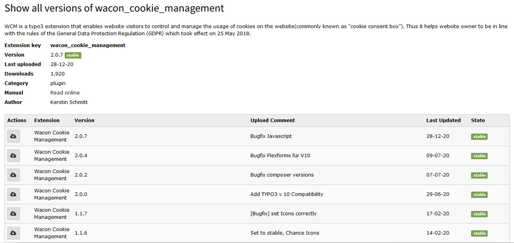
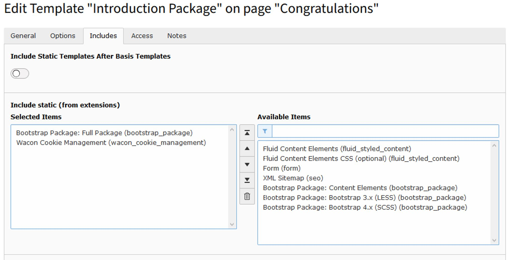
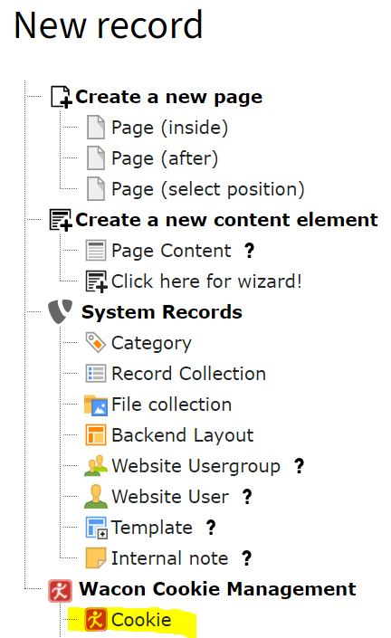
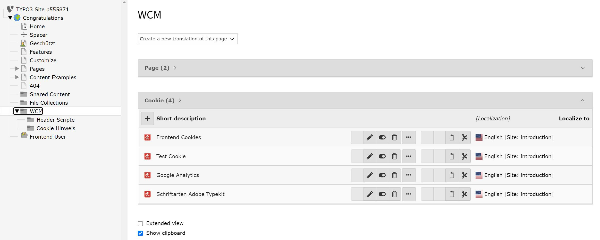

.. include:: ../Includes.txt

.. _installation:

============
Installation
============

Composer installation
===============
Install the extension via composer by using the following command

::

	composer req waconcookiemanagement/wacon_cookie_management

Installation via Extension Manager
===============
Serach for wacon_cookie_management and choose the proper version:

	Install WCM via Extension Manager

Include in your Template
===============
Include the WCM Template in your Site Template:

	Include static Template Wacon Cookie Management
	
Define your cookies
===============

Create a new folder for your cookies and scripts(here "WCM").

Go to the list module an create a "Cookie" record for each cookie you use on your website

	Define new cookie
	
Fill out the fields as accurate as possible

.. figure:: ../Images/wcm_screenshot7.jpg
   :class: with-shadow
   :alt: Cookie information
   :width: 500px

	Fields of a Cookie record

Edit Cookie information when needed

	Edit Cookie information
	
