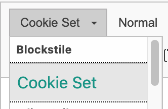

.. include:: ../Includes.txt

.. _configuration:

=============
Configuration
=============

Loading of jQuery
===============

This extensions loads its own jQuery file. You can disable it by adding the following TypoScript inside your
`constants.typoscript` or by editing the constants inside the constant editor in the Template module.

.. code-block:: typoscript

    plugin.tx_waconcookiemanagement_cookiefreigabe.settings.includeJQuery = 0

Adding links inside bodytext for displaying the cookie consent box
==================================================================

In Rich Text Editos you can make some settings inside your `.yaml` file so that you can insert links to the
cookie consent box inside any bodytext.

Put the following configuration inside your `.yaml` file for your RTE.
For example, it could be located inside `Configuration/RTE/Default.yaml` but this depends on your sitepackage/exension::

    editor:
        config:
            stylesSet:
                - { name: "Cookie Set", element: "p", attributes: { 'class': 'cookie-set' } }

With this settings, you get an extra dropdown item inside the Style-dropdown list.
This example surrounds the `
`-Tag with an extra class `cookie-set`. f.e.: `
Cookie settings
`

   Example of the dropdown.

.. important::
    You can use any other solution for adding this class to your text. It is important, that the element must have
    the class `cookie-set`.

    For example you can use a ``-Tag like `Cookies`.

    Be aware that you might need other settings than explained here.
