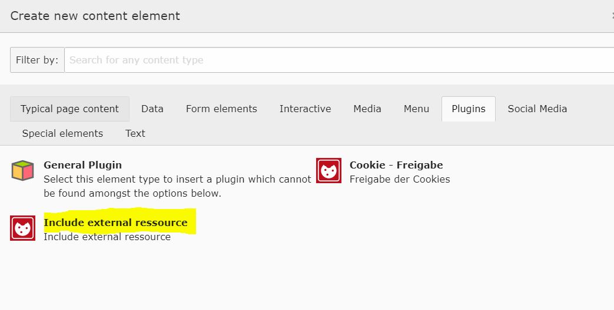
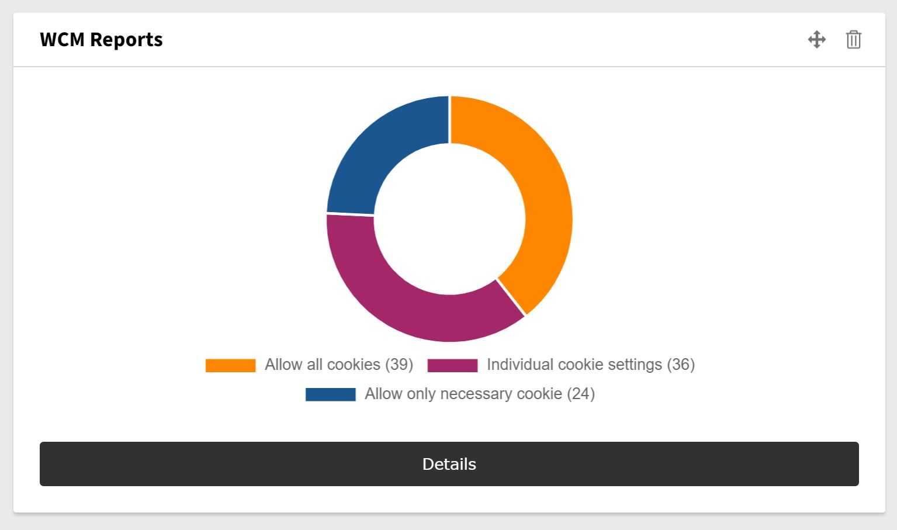
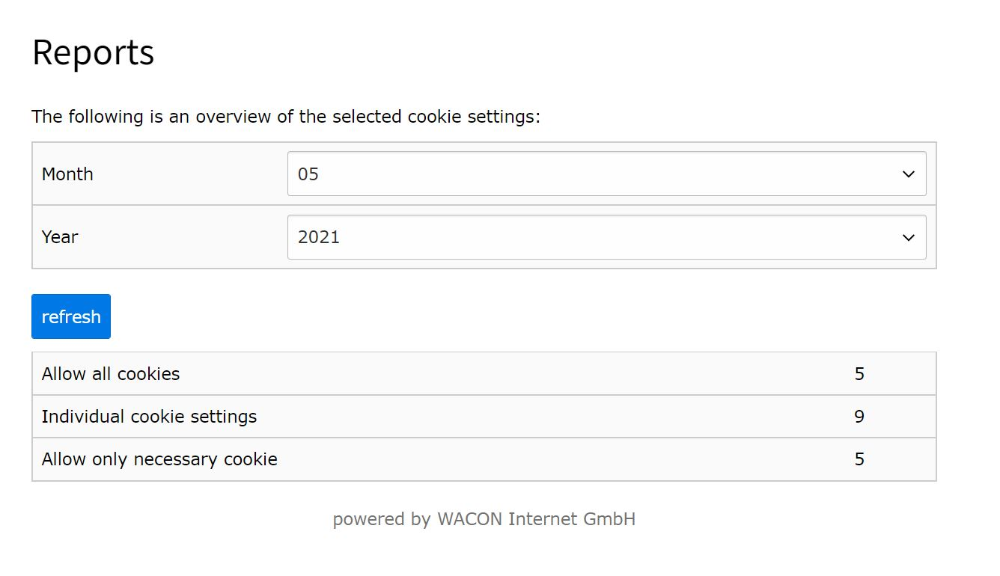

.. include:: ../Includes.txt

.. _for-editors:

===========
For Editors
===========

Manage cookies
==============
Manage your cookies by selecting the corresponding folder in the List module:

Create or edit a cookie record and supply the required information:

- Short description 
- Cookie name
- Category (Essential / Statistics / Marketing)
- Vendor
- Purpose
- Name
- Duration
- Link to Privacy Policy
- Server, that set the cookie

Use the plugin
==========
Prevent external content to load without consent by using the plugin "Include external resource":

	Include external resource
	
Fill out the fields:

- Choose the corresponding Cookie record
- Copy the script or html code in the field "Script"
- Deliver text to be shown if the resource is not accepted yet by the visitor
- And/or deliver an image to be shown if the resource is not accepted yet by the visitor ("Frosted glass effect")
- Tell the Plugin where your Cookie records are stored

.. figure:: ../Images/wcm_screenshot10.jpg
   :class: with-shadow
   :alt: Information of an external resource
   :width: 500px

	Define external resource
	
Show statistics
==========
Since TYPO3 v10 you can analyze the usage of the cookie settings with a dashboard widget:

.. important::
    You need to have the EXT:dashboard installed to view the widgets.

Click on "details" to select the information by month:

