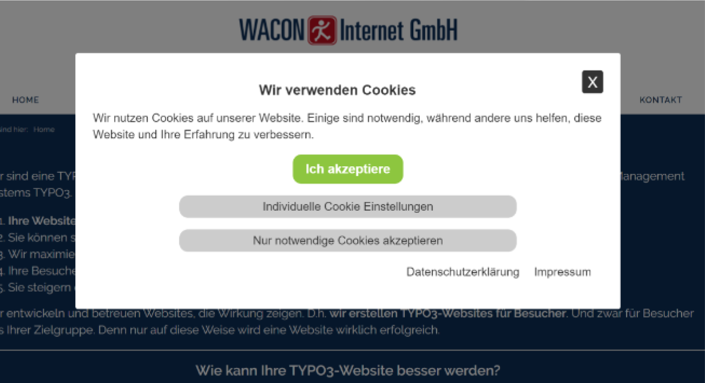

.. include:: ../Includes.txt

.. _introduction:

============
Introduction
============

What does it do?
================
wacon_cookie_management(WCM) is a TYPO3 extension that enables website owner to comply to the General Data Protection Regulation (GDPR) in terms of the usage of cookies an the inclusion of external ressources. The Plugin displays a cookie consent box whenever the permission of a website visitor is necessary (so called "opt-in" method), saves the settings and generates a cookie to identify the user in further page requests.

Types of cookies
================
If you run a website you have to consider at least two types of cookies:

- **necessary cookies** are those which are essential for a website to run properly (e.g. session cookies for a shopping cart or a password protected login area)
- **non-essential cookies** like tracking or third party cookies. These cookies are usually not necessary (in a technical sense) to run a website  and are therefore subject to approval.

Most common external ressources
================
Ask the website visitor for consent BEFORE you use: 

- social media plugins (e.g. "timelines")
- Google Maps
- external fonts (we recommend to install fonts locally)
- YouTube videos
- all other services included via iframe from an external server

Advantages of wacon_cookie_management(WCM)
============================

- WCM is easy to integrate
- WCM offers user control not only for cookies but external resources as well
- WCM doesn't need third party server or cookies
- WCM is fully customizable in terms of layout
- WCM offers TYPO3 editors an easy way to manage cookies, categories of cookies and a plugin for external resources
- WCM shows reports about the choices visitors made (anonymous by counting every chosen option)

.. _screenshots:

Screenshots
===========
The layout, position, content, images and options can be fully customized. Here are some samples:

   Frontend view of the cookie consent box
   
.. figure:: ../Images/wcm_screenshot2.jpg
   :class: with-shadow
   :alt: Link to open the cookie consent box 
   :width: 500px

   Visitors can change their preferences on any page via a link at the page

.. figure:: ../Images/wcm_screenshot3.jpg
   :class: with-shadow
   :alt: frosted glass effect
   :width: 500px

   "Frosted glass effect" to visualize a required consent
   
